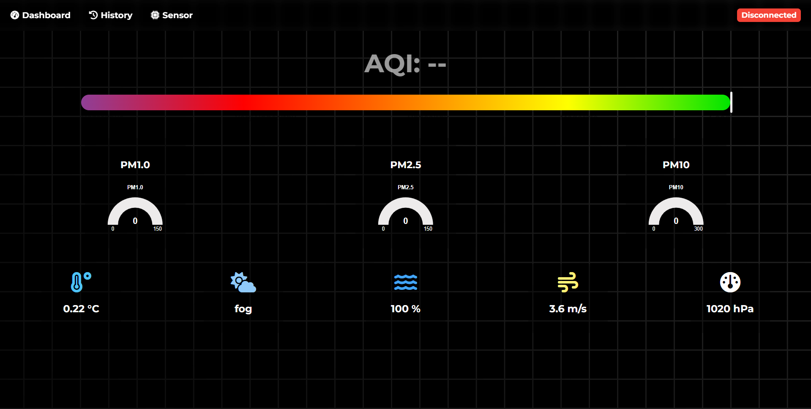

# PMS3003 Environmental Monitoring Dashboard

## Project Summary

This project is part of an internship to monitor air quality using a **PMS3003 Particulate Matter sensor** in Bydgoszcz, Poland. The dashboard collects PM1.0, PM2.5, PM10 data from the sensor and combines it with local weather information such as temperature, humidity, and AQI.  

The aim is to create a **minimal, real-time sensor monitoring dashboard** that visualizes air quality trends and sensor health in an interactive and informative way.

